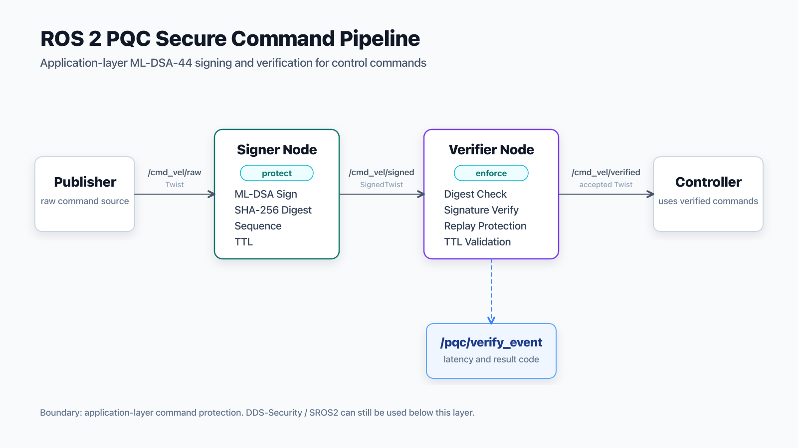
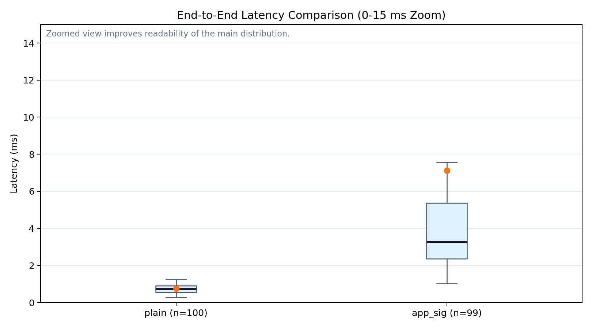
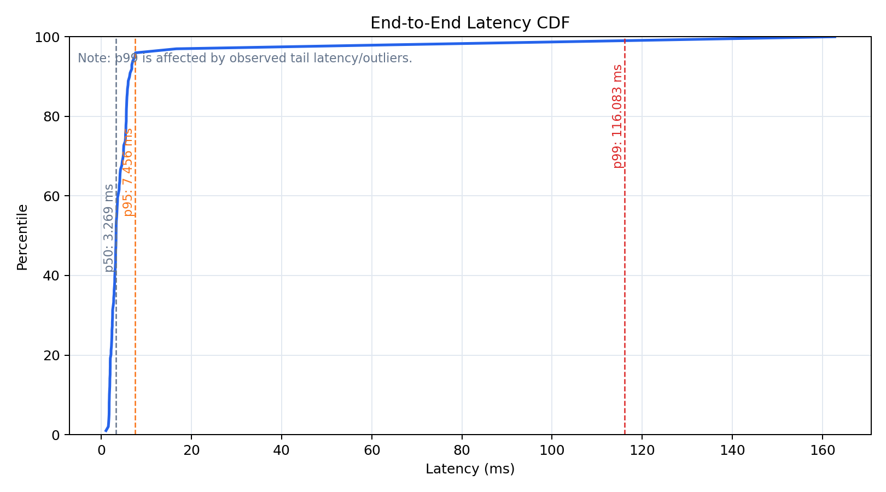
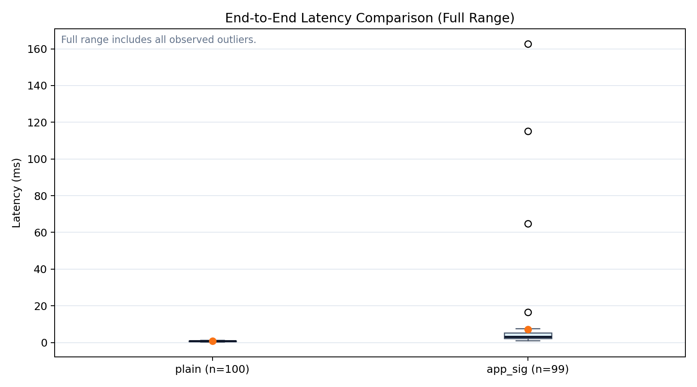

# ros2-pqc-secure-comm

Language:
[English](README.md) | [繁體中文](README_zh.md)


## 🔐 Project Overview

A ROS 2 application-layer secure communication pipeline using post-quantum
signature (ML-DSA-44) to protect control commands.

This project ensures:

- Command integrity (SHA-256 digest)
- Authenticity (ML-DSA signature)
- Replay protection (sequence window)
- Expiration control (TTL validation)
- Measurable latency (benchmark CSV)

It operates at the application layer and does not replace DDS-Security or SROS2.

## 🏗 Architecture



## 📊 Benchmark Results

The benchmark compares a plain ROS 2 command path with the application-layer
signed command pipeline. Latency is measured as end-to-end command delivery time.

| Mode | Samples | p50 e2e | p95 e2e | p99 e2e | Max | Success Rate |
|------|--------:|--------:|--------:|--------:|----:|-------------:|
| plain | 100 | 0.745 ms | 1.119 ms | 1.231 ms | 1.262 ms | 100% |
| app_sig | 99 | 3.269 ms | 7.456 ms | 116.083 ms | 162.747 ms | 100% |

The `app_sig` path adds the expected signing and verification overhead while
keeping the main latency distribution low. Most `app_sig` samples complete
within single-digit milliseconds, while a small number of outliers introduce a
long-tail latency distribution. The p99 value is therefore affected by tail
latency and should not be interpreted as "always under 10 ms."

### Latency Distribution (Main Range)



### End-to-End Latency CDF



<details>
<summary>Full Range Latency (including outliers)</summary>



</details>

## Reproduce Benchmark

Full benchmark run:

```bash
source /opt/ros/humble/setup.bash
source install/setup.bash

python3 scripts/run_and_plot_benchmark.py \
  --count 100 \
  --rate-hz 20 \
  --keys-dir ./src/keys \
  --output-dir docs
```

Plot-only mode uses existing CSV files and regenerates plots without re-running
ROS 2 benchmark launch files:

```bash
python3 scripts/run_and_plot_benchmark.py \
  --plot-only \
  --plain-csv docs/benchmark_plain.csv \
  --app-sig-csv docs/benchmark_app_sig.csv \
  --output-dir docs
```

## Benchmark Environment

- ROS 2 Humble
- Local single-machine benchmark
- Count: 100
- Publish rate: 20 Hz
- Metric: end-to-end command delivery latency
- Mode comparison: plain vs app_sig

## Known Limitations

- This MVP focuses on application-layer command integrity and authenticity.
- Payload encryption is not included.
- Dynamic key exchange and key rotation are not implemented.
- `sign_ns` is reserved for future signer-side timing and is currently recorded as 0.
- Current benchmark results are from a local single-machine run.
- Cross-device and real-robot network latency are future evaluation targets.

## Future Work

- Add two-container benchmark scenarios for distributed ROS 2 communication.
- Add cross-device benchmark over Wi-Fi or VPN.
- Add signer-side timing instrumentation.
- Add key rotation and trust-store update workflow.
- Evaluate ML-KEM-based session-key establishment for future encrypted channels.
- Compare SROS2 / DDS-Security with this application-layer PQC approach.
- Integrate with Nav2 or TurtleBot3 command pipelines.

## Documentation

- [Tutorial](docs/tutorial_en.md) / [繁體中文教學](docs/tutorial_zh.md)
- [架構說明](docs/architecture_zh.md) / [Architecture](docs/architecture_en.md)
- [威脅模型](docs/threat_model_zh.md) / [Threat model](docs/threat_model_en.md)
- [訊息格式](docs/message_spec_zh.md) / [Message spec](docs/message_spec_en.md)
- [Benchmark 說明](docs/benchmark_plan_zh.md) / [Benchmark plan](docs/benchmark_plan_en.md)
